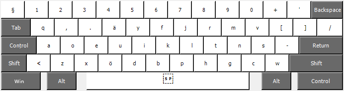

Around 2010, I created my own keyboard layout
based on the [Airas keyboard] which was a Dvorak layout variant based on Finnish letter frequencies.
I still use this layout on all my computers (NixOS and Win11 these days).

This repository contains resources for adding this custom layout for different operating systems:
- Fedora Linux:
  - Fedora 26
  - Fedora 29
- NixOS Linux
- Ubuntu Linux
  - Ubuntu 18.10
  - Ubuntu 19.10
  - Ubuntu 20.04
- Windows 11

Other similar efforts:
- [Granite Layout]

[Airas keyboard]: https://web.archive.org/web/20120208090148/http://mairas.net/projects/nappaimisto.php
[Granite Layout]: https://github.com/fohrloop/granite-layout
